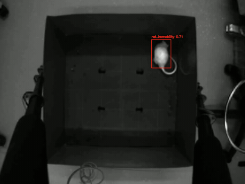

# Computer Vision Mice Tracking System
### (TFG) - Universidad Rey Juan Carlos (URJC)


**Automated analysis of rodent behavior for pharmacological studies using Deep Learning.**

---

## 📖 Project Overview
This project is developed as a **Bachelor's Thesis (Trabajo de Fin de Grado)** in Computer Engineering at **Universidad Rey Juan Carlos**.

The system automates the observation of **Open Field Tests**, a standard protocol in pharmacology to assess anxiety and locomotion in mice (specifically white mice in a box with holes). By replacing manual observation with Computer Vision, this tool aims to:
* Reduce human error and bias.
* Provide objective metrics (speed, time in zones, specific behaviors).
* Accelerate the testing process for new drugs (e.g., chemotherapy side effects).

---

## ⚙️ Key Features
Based on the current codebase, the system includes:

* **Hybrid Detection Engine:** Combines **YOLOv8** object detection with **Heuristic Rule-Based Logic** (`behavior_rules.py`) to distinguish complex actions.
* **Behaviors Detected:**
    * `rat_walking` / `rat_immobility`
    * `rat_rearing` (standing up in the center)
    * `rat_climbing` (climbing walls)
    * `rat_head_dipping` (exploring holes)
* **Interactive Zone Calibration:** A GUI tool to define the arena boundaries (Walls) and interest points (Holes) before analysis.
* **Data Toolkit:** Tools to extract frames from raw videos and build datasets automatically for training.
* **Automated Reporting:** Generates a CSV with frame-by-frame behavioral data and speed metrics.

---

## 📂 Project Architecture & File Hierarchy

The system is modularized to separate data management from the AI logic. Below is the index of the file structure and the utility of each module:

### 1. 🛠️ Main Entry Points (Scripts)
These are the files you execute directly in the terminal:

* **`main_model.py`**: **The Core Manager.** Use this for the daily workflow.
    * **Option 1 (Calibration):** Opens the GUI to draw walls and holes.
    * **Option 2 (Training):** Starts the YOLOv8 training process.
    * **Option 3 (Inference):** Runs the analysis on a video using the calibrated zones.
* **`main_data.py`**: **The Data Factory.** Use this only when building a new dataset.
    * **Option 1:** Extracts frames from raw videos for labeling.
    * **Option 2:** Compiles, shuffles, and splits labeled images into `train/valid` folders.

### 2. 🧩 Modules (`scripts/modules/`)

#### 🧠 Core (`modules/core/`)
Contains the business logic and detection algorithms.

* **`behavior_rules.py`**: **Heuristic Rules Engine.** This is the "brain" that corrects YOLO. It applies logic such as *"If the mouse is moving fast, it is walking"* or *"If it is at the wall and vertical, it is climbing"*. It solves conflicts between classes like `climbing` vs `head_dipping` based on location.
* **`calibrator.py`**: **Calibration Tool.** A GUI that allows the user to click and define the **Outer Boundary** (Walls), **Inner Boundary** (Safe Zone), and **Holes**. Saves coordinates to `coords.json`.
* **`detector.py`**: **Inference Engine.** Loads the trained model, processes the video frame-by-frame, calculates speed, and applies the `behavior_rules` to generate the final CSV and labeled video.
* **`trainer.py`**: **Training Wrapper.** Manages the YOLOv8 training session, automatically estimating batch size based on your GPU and applying data augmentation.

#### 🗃️ Dataset (`modules/dataset/`)
Tools for raw data handling.

* **`frame_extractor.py`**: Takes raw `.mp4` videos and extracts images at a specific frame rate for manual labeling.
* **`dataset_builder.py`**: The "Vacuum Cleaner." It gathers all labeled images, renames them to avoid conflicts, and structures them into the final YOLO directory format.

### 3. ⚙️ Helpers (`scripts/helpers/`)
Global configuration and utilities.

* **`config.py`**: **Control Center.** Contains all project paths (root, videos, models) and parameters (thresholds, model names). **If you change a video file, you update it here.**
* **`interfaces.py`**: Defines the abstract base classes to ensure code consistency across modules.

---

## 🚀 Workflow: How to Run a Test

To analyze a new video (e.g., `testRata2.mp4`), follow this specific order:

### Step 1: Configuration
Open `scripts/helpers/config.py` and update the `video_source` path:
```python
video_source: Path = root / "videos" / "testRata2.mp4"

### Step 2: Execution
Open your terminal in the scripts folder and run the model manager:
```bash
cd scripts
python main_model.py
```
### Step 3: Interactive Menu
Inside the menu, perform these actions in order:

1. Select Option 1 (Calibrate Zones):

   + The first frame of the video will appear.

   + Clicks 1-2: Define the Outer Wall (Blue rectangle).

   + Clicks 3-4: Define the Inner Boundary (Green rectangle). The area between Green and Blue is considered the "Wall Zone".

   + Clicks 5-8: Click the center of the 4 Holes (Red dots).

   + Press q to save and exit.
  
2. Select Option 3 (Execute Detection):

   + The system will load the model and the new coordinates.

   + It will process the video and save the results in output/analizado.mp4 and output/analizado.csv.
  
  ## Short demo


---

## 🚀 Installation

### Prerequisites
* Python 3.9+
* CUDA-compatible GPU (Recommended for training)

### Setup
```bash
# Clone the repository
git clone https://github.com/S4H0ST/Computer-Vision-Mice-Tracking.git
cd Computer-Vision-Mice-Tracking

# Create virtual environment (Optional but recommended)
python -m venv venv
source venv/bin/activate  # On Windows: venv\Scripts\activate

# Install dependencies
pip install ultralytics opencv-python numpy pydantic