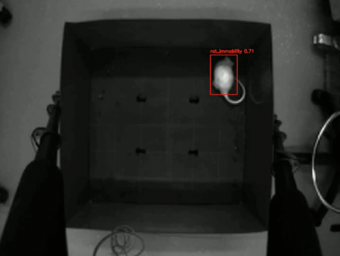

# 🐀 Computer Vision Mice Tracking System
### Bachelor's Thesis (TFG) - Universidad Rey Juan Carlos (URJC)


**Automated analysis of rodent behavior for pharmacological studies using Deep Learning (Pose Estimation and Recurrent Neural Networks).**

---

## 📖 Project Overview

This project automates the observation of the **Open Field Test**, a standard protocol in pharmacology used to assess anxiety and locomotion in mice (specifically white mice in a box with holes). 

By replacing manual observation with Computer Vision and Deep Learning, this tool allows researchers to:
* Eliminate human error and observational bias.
* Extract objective metrics based on the animal's biomechanics.
* Classify complex postures that require temporal analysis.


---

## 🧠 Hybrid Architecture (Key Features)

The system no longer relies on simple bounding boxes. Instead, it uses a two-phase hybrid AI architecture:

1. **The Eyes (YOLOv8 Pose):** Identifies skeletal *Keypoints* (Snout, Spine, Tail Base) frame by frame to capture exact biomechanics.
2. **The Brain (RNN - LSTM):** Analyzes the temporal sequence of these *Keypoints* to understand continuous movement and classify the action.
3. **The Instinct (Spatial Logic):** Maps the physical environment (walls, holes) to provide spatial context (e.g., *Head Dipping*).

### 🏷️ Detected Behaviors (Labels)
* `Walking` 
* `Immobility` 
* `Rearing` (Standing on hind legs)
* `Grooming` (Facial cleansing)
* `Head Dipping` (Exploring holes)
* `Climbing` (Scaling the walls)

---
## 📂 Project Structure

```text
Computer-Vision-Mice-Tracking/
├── data/                   # Datasets, CSV labels, and calibration coordinates
├── media/                  # Original input videos and demonstration GIFs
├── models/                 # Trained models (yolo_ratas.pt and best_rnn.pth)
├── scripts/
│   ├── helpers/            # Global configurations and paths (config.py)
│   ├── modules/
│   │   ├── core/           # Visual Detection (YOLO Pose), Training, and Calibration
│   │   ├── logic/          # Spatial Logic (Zone and Hole management)
│   │   └── brain/          # Recurrent Neural Network (RNN) and sequence handling
│   ├── tools/              # Utility scripts (frame extraction, formatting)
│   └── main_model.py       # MAIN ENTRY POINT
└── README.md

```

---

## 🚀 Installation and Requirements

### Prerequisites

* Python 3.9 or higher.
* CUDA-compatible GPU (Highly recommended for training and real-time inference).

### Installation Steps

1. **Clone the repository:**
```bash
git clone [https://github.com/YOUR_USERNAME/Computer-Vision-Mice-Tracking.git](https://github.com/YOUR_USERNAME/Computer-Vision-Mice-Tracking.git)
cd Computer-Vision-Mice-Tracking

```


2. **Create a virtual environment and install dependencies:**
```bash
pip install torch torchvision torchaudio --index-url [https://download.pytorch.org/whl/cu118](https://download.pytorch.org/whl/cu118)
pip install ultralytics opencv-python pandas pyyaml

```
---

## 🕹️ Workflow (Usage)

The system is designed to be highly modular. Run the main script to open the interactive menu:

```bash
cd scripts
python main_model.py

```

### Main Menu Options:

1. **[SETUP] Calibrate Zones:** Opens the first frame of the video. Click to define the outer wall, inner wall, and the center of the 4 holes (Creates `coords.json`).
2. **[EYES] Train YOLO Model:** Trains the visual model using the dataset labeled with articular points (Pose).
3. **[DATA] Generate CSV (YOLO Only):** Analyzes the video using only the visual model and saves the articular coordinates frame by frame into a `.csv` file.
4. **[BRAIN] Train Temporal Network (RNN):** Uses the previously generated `.csv` to teach the recurrent network how to interpret temporal movement patterns.
5. **[FINAL] Generate HYBRID FINAL VIDEO:** Runs the system in production by merging **YOLO Pose + Spatial Logic + RNN** to export the fully analyzed and corrected video.

---

## 📖 Project Evolution and Architecture Decision Record (ADR)

This project has gone through multiple research and development phases, iterating over different Computer Vision approaches to overcome physical limitations in detecting complex animal behavior.

### Phase 1: Base Tracking and Overfitting Control

* **Repository Status:** `[🔗 Insert Commit Link or Hash here]`
* **Objective:** Achieve 100% rat detection in the controlled environment.
* **Development:** Training began with a massive dataset. However, due to the high similarity between frames, the neural network suffered from severe *overfitting*.
* **Solution:** The dataset size was drastically reduced, and rigorous *Data Augmentation* was applied. Being a hyper-controlled environment, lighting modifications were discarded, applying exclusively geometric transformations (rotations, scaling, and cropping) to force the model to generalize the rodent's shape.

### Phase 2: Behavior Labeling and CNN Limitations

* **Repository Status:** `[🔗 Insert Commit Link or Hash here]`
* **Objective:** Classify static and dynamic postures using **MakeSense** for bounding box labeling.
* **Physical Problem:** Convolutional Neural Networks (CNNs) like YOLO analyze frame by frame. For a CNN without temporal context, a rat *Walking* looks visually identical to an *Immobile* rat, since the outer Bounding Box enclosing them is exactly the same.

*[📸 INSERT IMAGE: Screenshot of MakeSense showing a square bounding box around the rat]*

### Phase 3: Mathematical Heuristics and Spatial Logic (Brute Force)

* **Repository Status:** `[🔗 Insert Commit Link or Hash here]`
* **Objective:** Differentiate movement from inactivity by measuring spatial pixel displacement.
* **Development:** Algorithmic logic was implemented by extracting the centroid $(cx, cy)$ of the Bounding Box in each frame. Displacement speed was calculated using the Euclidean distance between consecutive frames:

$$v = \frac{\sqrt{(cx_t - cx_{t-1})^2 + (cy_t - cy_{t-1})^2}}{\Delta t}$$

* **Result:** This allowed estimating the *Walking* state using speed thresholds and mapping the spatial location relative to walls/holes. Even so, it remained a fragile system against subtle posture changes.

### Phase 4: Temporal Integration (RNN) and Dual Tracking

* **Repository Status:** `[🔗 Insert Commit Link or Hash here]`
* **Objective:** Provide the system with "memory" to understand continuous actions over time.
* **Development:** A Recurrent Neural Network (RNN) was introduced to analyze YOLO's historical data, and a specific *Box Tracking* was added for the rat's head.
* **Phase Status:**
[SUCCESS] Perfect detection of Head Dipping thanks to head tracking and spatial zones.

[WARNING] Data Issue: Climbing failed due to a shortage of images in atypical vertical positions.

[FAIL] Architectural Limit: The RNN still confused Rearing, Grooming, and Walking because the outer bounding box is "blind" to the articular micro-movements of the limbs.

### 🚀 Phase 5 (Current): Architectural Leap to YOLO Pose (Pose Estimation)

* **Repository Status:** In Active Development (`main`)
* **Objective:** Overcome geometric ambiguity by moving from an "area" approach to an "articular biomechanics" approach.
* **Development:** Bounding boxes are replaced by **Skeletal Keypoints** (Snout, Spine Center, Tail Base).
* **Technological Base:** The **YOLOv8-Pose** model is used, which shares the real-time inference *backbone* but adapts its output *head* to predict matrices of articular point coordinates.
* **Key Advantage:** It allows the RNN to differentiate complex states by measuring the variation in height ($Y$) between the snout and the tail (solving the Walking vs Rearing conflict) or by detecting exclusive local vibrations in the snout (Grooming).

*[📸 INSERT IMAGE: A screenshot of you labeling articular points in Roboflow/CVAT, or the final skeleton drawn during inference]*


