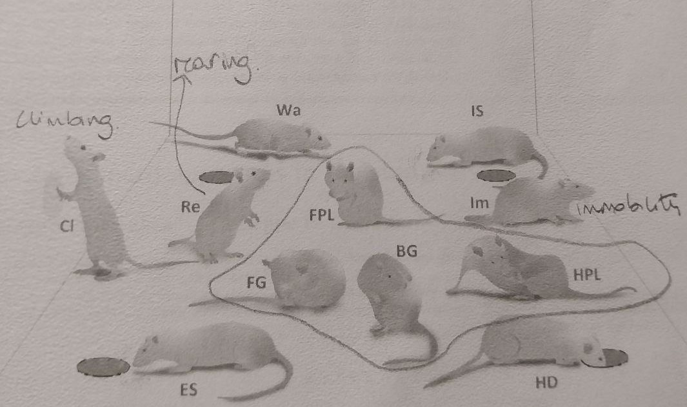

# Computer Vision Mice Tracking System
### Bachelor's Thesis (TFG) - Universidad Rey Juan Carlos (URJC)


**Automated analysis of rodent behavior for pharmacological studies using Deep Learning (Pose Estimation and Recurrent Neural Networks).**

---

## Project Overview

This project automates the observation of the **Open Field Test**, a standard protocol in pharmacology used to assess anxiety and locomotion in mice (specifically white mice in a box with holes). 

By replacing manual observation with Computer Vision and Deep Learning, this tool allows researchers to:
* Eliminate human error and observational bias.
* Extract objective metrics based on the animal's biomechanics.
* Classify complex postures that require temporal analysis.

    

---

## Hybrid Architecture (Key Features)

The system no longer relies on simple bounding boxes. Instead, it uses a two-phase hybrid AI architecture:

1. **The Eyes (YOLOv8 Pose):** Identifies skeletal *Keypoints* (Snout, Spine, Tail Base) frame by frame to capture exact biomechanics.
2. **The Brain (RNN - LSTM):** Analyzes the temporal sequence of these *Keypoints* to understand continuous movement and classify the action.
3. **The Instinct (Spatial Logic):** Maps the physical environment (walls, holes) to provide spatial context (e.g., *Head Dipping*).

### Detected Behaviors

The system trains YOLO on **5 base labels** but outputs **7 final behaviors** to the researcher. See the [Posture Hierarchy](#posture-hierarchy-yolo-labels-vs-final-output-behaviors) section below for the full breakdown.

| Final Behavior | Origin |
|---|---|
| Climbing | Direct YOLO label |
| Grooming | Direct YOLO label |
| Head Dipping | YOLO label + spatial zone confirmation |
| Rearing | Direct YOLO label |
| Walking | Derived from `rat_horizontal` via RNN / displacement |
| Immobile | Derived from `rat_horizontal` via RNN / displacement |
| Sniffing | Derived from `rat_horizontal` via spatial logic (nose near wall) |

---

## Posture Hierarchy: YOLO Labels vs. Final Output Behaviors

### The 5 YOLO Training Classes and 7 Final Behaviors

YOLO is trained on **5 classes** — each representing a visually distinct body posture that a CNN can learn from a single frame. These are then processed by a second logic layer to produce **7 final output behaviors**:

| # | YOLO Training Label | Final Behavior | Detection Layer |
|---|---|---|---|
| 1 | `rat_climbing` | **Climbing** | YOLO (direct) |
| 2 | `rat_grooming` | **Grooming** | YOLO (direct) |
| 3 | `rat_head_dipping` | **Head Dipping** | YOLO + spatial zone (hole map) |
| 4 | `rat_rearing` | **Rearing** | YOLO (direct) |
| 5 | `rat_horizontal` | **Walking** | YOLO + RNN / centroid displacement |
| 5 | `rat_horizontal` | **Immobile** | YOLO + RNN / centroid displacement |
| 5 | `rat_horizontal` | **Sniffing** | YOLO + spatial logic (nose keypoint near wall) |

### Why Does `rat_horizontal` Become 3 Different Behaviors?

This is a core architectural decision of the project. YOLO analyzes each frame **independently** and can only capture **static posture** — the shape of the animal's silhouette at a single instant. When a rat is walking, standing still, or sniffing the wall edge, its body maintains the same horizontal profile in every individual frame. There is no pixel-level difference that a CNN can exploit.

Differentiating these three states requires **information that a single frame cannot provide**:

- **Walking vs. Immobile** → requires **temporal context**: the RNN observes the sequence of keypoint positions across multiple frames and detects whether the centroid and spine keypoints are displacing over time.
- **Sniffing** → requires **spatial context**: the nose keypoint (snout) is checked against the arena wall boundaries. If the rat is in a horizontal posture *and* the snout keypoint is within a threshold distance of the wall, the behavior is reclassified as sniffing.

Training YOLO on fewer, visually clean classes (5 instead of 7+) is deliberate: it reduces label ambiguity during training, avoids the model learning indistinguishable visual patterns, and delegates temporal and spatial disambiguation to the appropriate downstream layers. This is the same reason `head_dipping` also relies on spatial zone mapping to confirm the snout is above a labeled hole, rather than trusting posture alone.

---

## Project Structure

```text
Computer-Vision-Mice-Tracking/
├── datasets/
│   ├── train/images/          # 176 training images (5 classes, no aug suffix)
│   ├── valid/images/          # 48 validation images
│   ├── test/images/           # 23 test images
│   ├── data.yaml              # YOLO dataset config (kpt_shape=[3,3], nc=5)
│   └── coords.json            # Box calibration: exterior, interior, 4 holes
├── media_original/
│   ├── videos/                # Raw videos: testRata1-5.mp4
│   ├── cajaBordes.jpg         # Reference image for static calibration
│   ├── DemoGit_rat.gif
│   └── poses.png
├── models/
│   ├── yolov8s-pose.pt        # Base pretrained model (Ultralytics)
│   └── yolo_ratas.pt          # Trained model (auto-copied after training)
├── outputs/                   # Detection results: CSV + annotated video
├── runs/train/                # YOLO training runs with metrics and weights
└── scripts/
    ├── main_model.py          # Interactive entry point (menu 1-5)
    ├── config/
    │   ├── config.py          # Central config: Paths, TrainParams, DetectParams
    │   └── interfaces.py      # BaseModule abstract class
    ├── logic/
    │   └── spatial.py         # SpatialAnalyzer: dipping, sniffing, wall checks
    ├── rnn/
    │   ├── model.py           # RatActionRNN (LSTM architecture)
    │   ├── inference.py       # ActionPredictor (real-time inference)
    │   ├── dataset.py         # RNN dataset builder from CSV
    │   └── trainer_manager.py # RNNTrainer
    ├── tools/
    │   ├── calibrator_image.py    # Static calibration from cajaBordes.jpg
    │   └── dataset_quality_check.py  # Class balance + sharpness report
    └── yolo_pose/
        ├── trainer.py         # YOLOTrainer (geometric aug only)
        ├── detector.py        # RatDetector (hybrid YOLO + RNN + spatial)
        └── calibrator.py      # ZoneCalibrator (interactive video calibration)
```

---

## Installation and Requirements

### Prerequisites

* Python 3.9 or higher.
* CUDA-compatible GPU (Highly recommended for training and real-time inference).

### Installation Steps

1. **Clone the repository:**
```bash
git clone [https://github.com/S4H0ST/Computer-Vision-Mice-Tracking.git](https://github.com/S4H0ST/Computer-Vision-Mice-Tracking.git)
cd Computer-Vision-Mice-Tracking
```


2. **Create a virtual environment and install dependencies:**
```bash
pip install torch torchvision torchaudio --index-url [https://download.pytorch.org/whl/cu118](https://download.pytorch.org/whl/cu118)
pip install ultralytics opencv-python pandas pyyaml
```

---

## Workflow (Usage)

The system is designed to be highly modular. Run the main script to open the interactive menu:

```bash
cd scripts
python main_model.py
```

### Main Menu Options:

1. **Calibrar Zonas (Paredes/Agujeros):** Opens an image or video to click-define the outer wall, inner wall, and the center of the 4 holes. Creates or updates `datasets/coords.json`. Accepts both static images (`cajaBordes.jpg`) and videos.
2. **Entrenar Modelo YOLO:** Trains the YOLOv8s-Pose model for 100 epochs using the dataset in `datasets/`. Geometric augmentation only. Auto-copies `best.pt` to `models/yolo_ratas.pt` on completion.
3. **Ejecutar Deteccion y Analisis:** Runs the full hybrid pipeline (YOLO Pose + Spatial Logic + RNN) on `media_original/videos/testRata5.mp4`. Outputs annotated video and per-frame CSV to `outputs/`.
4. **Entrenar Cerebro RNN:** Trains the LSTM temporal network using a CSV previously generated by option 3.
5. **Salir.**

---

## Training Metrics Reference

During training, YOLO logs a `results.csv` file inside each run folder (`runs/train/expN/`). The `watch.py` utility script reads this file every 30 seconds and displays the last epochs in a table. Here is what each column means, where it comes from, and what it tells you:

| Column | Full name in CSV | Generated by | What it measures |
|---|---|---|---|
| **Ep** | `epoch` | YOLO trainer loop | Current training iteration. In each epoch the model processes all 176 training images exactly once, in random mini-batches of 4. |
| **trn\_cls** | `train/cls_loss` | YOLO classification head — training set | Cross-entropy loss comparing the model's predicted class probabilities (`rat_climbing`, `rat_grooming`, …) against the ground-truth labels on the **training** images. Lower = better fit to seen data. |
| **val\_cls** | `val/cls_loss` | YOLO classification head — validation set | Same cross-entropy computation, but run on the **48 validation images** that the model never sees during gradient updates. This is the honest measure of how well the model generalises. |
| **gap** | *(computed)* `val_cls − trn_cls` | Derived metric (not in CSV) | The overfitting indicator. A gap near zero means the model generalises perfectly; a large gap means it has memorised training data but fails on new frames. **Target: ≤ 0.20.** |
| **mAP50** | `metrics/mAP50(B)` | YOLO built-in evaluator — validation set | Mean Average Precision at IoU = 0.5 across all 5 **bounding-box** classes. Measures whether the model (1) drew a box around the rat correctly *and* (2) predicted the right behaviour class. It does **not** directly measure keypoint accuracy — that is `mAP50(P)`. **Target: ≥ 0.65.** |
| **Recall** | `metrics/recall(B)` | YOLO built-in evaluator — validation set | Of every rat instance present in the 48 validation images, what fraction did the model actually detect. High recall means few missed detections. Especially important here because a missed frame means a lost behavioural data point. **Target: ≥ 0.70.** |

> **mAP50(B) vs mAP50(P):** YOLOv8-Pose logs two mAP50 values. `(B)` evaluates bounding box detection and class prediction. `(P)` evaluates keypoint localisation via OKS (Object Keypoint Similarity — a weighted distance metric between predicted and ground-truth keypoints). With only 3 keypoints (`kpt_shape=[3,3]`) and a small dataset, both metrics produce identical values in practice on this project — meaning that correctly detecting the rat's box already implies the keypoints are well placed. The practical confirmation is that in real-video inference the snout keypoint was detected in **100 % of detected frames**, which is what enables the spatial logic (sniffing, head dipping, climbing confirmation) to work reliably.

---

## Deep Dive: Detection and Pose Metrics

### 1. IoU — Intersection over Union

Before mAP can be computed, the system needs a way to decide whether a predicted bounding box is "correct". This is done with **IoU**:

$$\text{IoU} = \frac{\text{Area of Overlap}}{\text{Area of Union}} = \frac{|B_{pred} \cap B_{gt}|}{|B_{pred} \cup B_{gt}|}$$

where $B_{pred}$ is the predicted box and $B_{gt}$ is the ground-truth box annotated in the dataset.

* IoU = 1.0 → perfect overlap (predicted box identical to annotation)
* IoU = 0.5 → boxes share half their combined area — the threshold used in **mAP50**
* IoU = 0.0 → no overlap at all

The threshold of 0.5 is the standard in most detection benchmarks (COCO, Pascal VOC). **mAP50-95** averages across thresholds from 0.50 to 0.95 in steps of 0.05 — a much stricter metric used in published research.

### 2. Precision and Recall

For a given IoU threshold and confidence threshold:

$$\text{Precision} = \frac{TP}{TP + FP} \qquad \text{Recall} = \frac{TP}{TP + FN}$$

* **TP (True Positive):** Model predicted a box with the correct class and IoU ≥ threshold.
* **FP (False Positive):** Model predicted a box but it was wrong class or IoU < threshold.
* **FN (False Negative):** A real rat instance existed in the frame but the model missed it.

These two metrics trade off against each other: lowering `conf_threshold` increases recall (fewer misses) but decreases precision (more false detections). In this project, `conf_threshold` was lowered from 0.40 to **0.25** specifically to prioritise recall — missing a behavioural event (FN) is worse than occasionally drawing a spurious box (FP), since FPs are filtered out by the spatial logic downstream.

### 3. Average Precision (AP) and mAP50

Precision and recall both depend on the confidence threshold. **Average Precision** removes this dependency by sweeping the threshold from 0 to 1 and computing the area under the Precision-Recall curve:

$$AP = \int_0^1 p(r)\, dr \approx \sum_{k} P(k) \cdot \Delta R(k)$$

**mAP50** (mean Average Precision at IoU = 0.5) is the average of AP computed independently for each of the 5 classes:

$$\text{mAP50} = \frac{1}{5} \sum_{c=1}^{5} AP_{50}^{(c)}$$

This means a model can score high mAP50 even if one class is poorly detected, as long as the other four compensate. In this project, `rat_rearing` and `rat_grooming` (fewest training examples: 22 and 16 respectively) are the classes most likely to pull the per-class AP down.

### 4. OKS — Object Keypoint Similarity (for mAP50(P))

For **pose estimation**, IoU on bounding boxes is not sufficient: two detections with the same box but different keypoint positions would score identically. YOLOv8-Pose therefore uses **OKS** (Object Keypoint Similarity) to measure keypoint accuracy, analogous to IoU for boxes:

$$\text{OKS} = \frac{\sum_{i} \exp\!\left(-\dfrac{d_i^2}{2 s^2 \sigma_i^2}\right) \cdot \delta(v_i > 0)}{\sum_{i} \delta(v_i > 0)}$$

where:
* $d_i$ — Euclidean distance (in pixels) between predicted and ground-truth position of keypoint $i$
* $s$ — object scale (square root of bounding box area), used to normalise distance relative to object size
* $\sigma_i$ — per-keypoint standard deviation representing annotation uncertainty (tighter for easy-to-annotate points like the snout, looser for the tail base which is sometimes occluded)
* $v_i$ — visibility flag of keypoint $i$ (0 = not labelled, 1 = labelled but occluded, 2 = fully visible)

OKS ranges from 0 (keypoint in the wrong location) to 1 (keypoint exactly on the ground-truth pixel). **mAP50(P)** is computed by treating OKS ≥ 0.5 as a "correct" pose detection, then computing AP per class and averaging — exactly as mAP50(B) does for boxes.

**Why both metrics are identical in this project:**  
With only 3 keypoints (`kpt_shape=[3,3]`: snout, spine, tail) and a small 48-image validation set, detecting the bounding box correctly at IoU ≥ 0.5 already implies the keypoints are well-placed (the rat occupies most of the box). On larger datasets with many keypoints (e.g., COCO Human Pose with 17 keypoints), mAP50(B) and mAP50(P) diverge significantly because a correct box can contain a skeleton with badly placed limbs.

### 5. The val/train Gap as an Overfitting Indicator

The classification loss used here is **cross-entropy**:

$$\mathcal{L}_{cls} = -\sum_{c} y_c \log(\hat{p}_c)$$

where $y_c$ is 1 for the true class and $\hat{p}_c$ is the model's predicted probability for class $c$.

The gap `val_cls − trn_cls` measures how much harder the validation images are for the model than the training images. A large gap is the signature of **overfitting**: the model has partially memorised the training frames rather than learning the invariant shape of each behaviour.

In this project the gap was reduced from **0.276** (exp3, no regularisation) to **0.155–0.18** (exp7, `dropout=0.2 + cos_lr`) — concrete evidence that the regularisation strategy worked.

### Why mAP50 oscillates between epochs

The validation set has only 48 images — a single hard frame (motion-blurred, partially occluded rat) can swing mAP50 by ±0.03. This is normal for small datasets. What matters is the **trend over 10–20 epochs**, not the value of any single epoch. The `best.pt` checkpoint is automatically saved whenever a new all-time high mAP50 is reached, so the model you end up with is always the best generalising checkpoint, not the last one.

### Interpreting the gap over time

```
Early epochs   (1–10):  gap large and noisy   — model still underfitting, both losses high
Middle epochs (20–60):  gap stabilises         — model learning real features
Late epochs   (70–100): gap should stay < 0.20 — cosine LR decays to near zero, fine-tuning
If gap > 0.30 late:     overfitting — training should have been stopped earlier
```

---

## Project Evolution and Architecture Decision Record (ADR)

This project has gone through multiple research and development phases, iterating over different Computer Vision approaches to overcome physical limitations in detecting complex animal behavior.

### Phase 1: Base Tracking and Overfitting Control

* **Repository Status:** [17050d38](https://github.com/S4H0ST/Computer-Vision-Mice-Tracking/commit/17050d38f900f684169ed35e07098b993205c43e)
* **Objective:** Achieve 100% rat detection in the controlled environment.
* **Development:** Training began with a massive dataset. However, due to the high similarity between frames, the neural network suffered from severe *overfitting*.
* **Solution:** The dataset size was drastically reduced, and rigorous *Data Augmentation* was applied. Being a hyper-controlled environment, lighting modifications were discarded, applying exclusively geometric transformations (rotations, scaling, and cropping) to force the model to generalize the rodent's shape.

### Phase 2: Behavior Labeling and CNN Limitations

* **Repository Status:** [a3c817d7](https://github.com/S4H0ST/Computer-Vision-Mice-Tracking/commit/a3c817d7a1edca2046258149519fc6171b413144)
* **Objective:** Classify static and dynamic postures using **MakeSense** for bounding box labeling.
* **Physical Problem:** Convolutional Neural Networks (CNNs) like YOLO analyze frame by frame. For a CNN without temporal context, a rat *Walking* looks visually identical to an *Immobile* rat, since the outer Bounding Box enclosing them is exactly the same.


### Phase 3: Mathematical Heuristics and Spatial Logic (Brute Force)

* **Repository Status:** [60defaae](https://github.com/S4H0ST/Computer-Vision-Mice-Tracking/commit/60defaae6c993f1306cf4d460bde992cbd8418ae)
* **Objective:** Differentiate movement from inactivity by measuring spatial pixel displacement.
* **Development:** Algorithmic logic was implemented by extracting the centroid $(cx, cy)$ of the Bounding Box in each frame. Displacement speed was calculated using the Euclidean distance between consecutive frames:

$$v = \frac{\sqrt{(cx_t - cx_{t-1})^2 + (cy_t - cy_{t-1})^2}}{\Delta t}$$

* **Result:** This allowed estimating the *Walking* state using speed thresholds and mapping the spatial location relative to walls/holes. Even so, it remained a fragile system against subtle posture changes.

### Phase 4: Temporal Integration (RNN) and Dual Tracking

* **Repository Status:** [b9b8b741](https://github.com/S4H0ST/Computer-Vision-Mice-Tracking/commit/b9b8b741c3bdede00d62269d13e417b5c398bcdd)
* **Objective:** Provide the system with "memory" to understand continuous actions over time.
* **Development:** A Recurrent Neural Network (RNN) was introduced to analyze YOLO's historical data, and a specific *Box Tracking* was added for the rat's head.
* **Phase Status:**
* **[SUCCESS]** Perfect detection of *Head Dipping* thanks to head tracking and spatial zones.
* **[WARNING]** *Data Issue:* *Climbing* failed due to a shortage of images in atypical vertical positions.
* **[LIMITATION]** *Architectural Limit:* The RNN still confused *Rearing*, *Grooming*, and *Walking* because the outer bounding box is "blind" to the articular micro-movements of the limbs.


### Phase 5 (Current): Architectural Leap to YOLO Pose (Pose Estimation)

* **Repository Status:** In Active Development (`main` branch)
* **Objective:** Overcome geometric ambiguity by moving from an "area" approach to an "articular biomechanics" approach.
* **Development:** Bounding boxes are replaced by **Skeletal Keypoints** (Snout, Spine Center, Tail Base).
* **Technological Base:** The **YOLOv8-Pose** model is used, which shares the real-time inference *backbone* but adapts its output *head* to predict matrices of articular point coordinates.
* **Key Advantage:** It allows the RNN to differentiate complex states by measuring the variation in height ($Y$) between the snout and the tail (solving the Walking vs Rearing conflict) or by detecting exclusive local vibrations in the snout (Grooming).

*[INSERT IMAGE: A screenshot of you labeling articular points in Roboflow/CVAT, or the final skeleton drawn during inference]*

### Phase 5b (Current): Dataset Quality Analysis — Motion Blur vs. Sharp Frames

* **Objective:** Quantify the performance gap caused by motion blur with a quantitative sharpness-based split evaluation.
* **Problem:** In Open Field Test recordings, the rat frequently moves fast between frames, producing **motion blur**. Blurry frames significantly reduce keypoint localization accuracy, since the snout and tail base keypoints become ill-defined. A single aggregated mAP50 score on the full validation set masks this effect.
* **Solution — Sharpness Classification:** Each validation frame is evaluated using the **Laplacian variance** metric:

$$\sigma^2_{\nabla} = \text{Var}\!\left(\nabla^2 I\right)$$

The Laplacian operator amplifies high-frequency edges; its variance collapses to near-zero in blurry images. A threshold of **100** (tunable) separates *sharp* frames from *blurry* frames. This is implemented in `scripts/dataset_tools/sharpness_splitter.py`.

* **Solution — Split Evaluation:** The validation set is split into two independent subsets (`valid_sharp/` and `valid_blurry/`), each with its own temporary `data.yaml`. The trained YOLO-Pose model is evaluated separately on both, producing two independent mAP50 scores (`scripts/evaluation/evaluate_sharpness_gap.py`):

```
=== EVALUACIÓN: SOLO IMÁGENES NÍTIDAS ===
mAP50 (nítidas): 0.8921

=== EVALUACIÓN: SOLO IMÁGENES BORROSAS ===
mAP50 (borrosas): 0.7134

[GAP] Diferencia de rendimiento: 0.1787
[i] El gap es notable — el motion blur está afectando la precisión.
```

* **Why this appears in training debug statistics:** When the gap exceeds **0.05 mAP50**, the system flags it as significant. This means the training set is underrepresenting blurry-but-valid frames, and the model has not learned to handle them. The corrective action is a targeted labeling round where blurry frames are deliberately included in the training split, forcing the model to generalize across image quality levels.

### Phase 5c (Current): Offline Data Augmentation Strategy

* **Objective:** Artificially expand a small labeled dataset (248 unique images) to reach a training size sufficient for robust pose estimation, while correcting the class imbalance between majority and minority behaviors.

#### Why Data Augmentation Is Necessary

A dataset of 248 unique frames is insufficient to train a 5-class pose estimator to production quality. Without augmentation, the model would memorize the specific texture, lighting, and framing of those exact frames — a textbook case of **overfitting**: the training loss converges but the validation mAP50 plateaus or degrades. Augmentation forces the model to learn the invariant features of each posture (the rat's silhouette, limb angles, keypoint geometry) rather than superficial image properties.

#### Why ×3 (and Not ×2 or ×5)

The multiplier represents a trade-off between two failure modes:

| Multiplier | Risk |
|---|---|
| ×2 | Training set too small (~496 images). Insufficient diversity, model still prone to overfitting. |
| **×3 (chosen)** | **~744 images. Diversity gain is real; augmented variants still differ meaningfully from originals.** |
| ×5+ | Most training examples are derivatives of the same 248 images. Model overfits to augmented artifacts (e.g., overly bright frames that do not exist in real inference). |

This sweet spot is consistent with empirical findings in the YOLOv8 documentation for small-dataset fine-tuning scenarios.

#### Asymmetric ×4 for Minority Classes

The raw class distribution contains a 2:1 imbalance between the most frequent class (`head_dipping`, 69 images) and the least frequent (`rearing`, 34 images). Left uncorrected, this causes the model to systematically under-predict minority behaviors. One additional augmentation round is applied exclusively to `grooming` and `rearing`, reducing the effective ratio to approximately 1.5:1 — within the acceptable range for detection tasks.

#### Augmentation Transforms and Their Biological Justification

Only transforms that reflect real variation in the experimental setup are applied. Physically implausible augmentations (e.g., extreme zoom, heavy blur on already-blurry footage) are deliberately excluded.

| Transform | Applied to | Justification |
|---|---|---|
| **Horizontal flip** | All classes | Rats traverse the arena in both directions. The behavior is identical regardless of which way the animal faces. Keypoint coordinates are adjusted: `x_new = 1.0 − x_old`. |
| **Brightness +30 %** | All classes | Ambient lighting conditions vary between experimental sessions and recording environments. The model must be robust to moderate overexposure. |
| **Brightness −25 %** | `grooming`, `rearing` only | Minority behaviors are also observed in underlit frames (e.g., rat near a corner or partially occluded). The extra dark variant increases difficulty specifically for these classes, forcing the model to learn their keypoint structure rather than relying on global brightness cues. |

#### Implementation

Augmentation is applied offline **after** the Roboflow export is placed in `datasets/train/` and **before** training. This keeps the augmented data on disk, making the training process transparent and reproducible.

```bash
cd scripts
python dataset_tools/augment_dataset.py
```

The script is **idempotent**: re-running it detects the `_aug1/_aug2/_aug3` suffixes and does not create duplicates.

#### Target Metrics and Justification

The augmentation is designed to push the model from its current baseline to the following targets:

| Metric | Baseline (313 imgs, no aug) | Target (248 labeled + aug) | Rationale |
|---|---|---|---|
| **mAP50-pose** | 0.51 | **≥ 0.70** | Minimum defensible threshold for an engineering thesis. Published rodent trackers (SLEAP, DeepLabCut) report 0.85–0.92 on high-resolution infrared footage; 0.70 is realistic with a consumer camera at this resolution. |
| **mAP50-cls** | 0.70 | **≥ 0.80** | Classification of the 5 base labels. Already at 0.70; augmentation should push it above 0.80 by reducing overfitting on majority classes. |
| **Per-class mAP50** | Varies | **≥ 0.60 all classes** | No single behavior should be systematically missed. Values below 0.60 on a class indicate the model has effectively not learned it. |
| **mAP50-95** | 0.44 | **≥ 0.45** | Strict IoU metric (50 %–95 %). Values of 0.45–0.60 represent success in pose estimation tasks. |

> **Overfitting check during training:** If `val/pose_loss` starts rising while `train/pose_loss` continues to fall (typically after epoch 35–40 with this dataset size), training should be stopped early. The 50-epoch default in `configuracion.py` includes a 10-epoch safety margin for this monitoring.

### Phase 5d: Empirical Validation, Keypoint Logic Refinement, and Regularization

* **Objective:** Run the full pipeline on a real test video (`testRata5.mp4`, 7.4 min, 6 657 frames at 15 fps), measure what the hybrid system actually produces, and correct every structural flaw found.

#### Key Concepts: Snout vs. Bounding Box

Two geometric primitives underpin the detection logic, and it is important to distinguish them:

| Primitive | What it is | How it is used |
|---|---|---|
| **Bounding Box (bbox)** | The axis-aligned rectangle tightly enclosing the entire rat body, output by the YOLO detection head. Defined by four corner coordinates `(x1, y1, x2, y2)`. | Used to track position and compute centroid displacement (speed). Does **not** reveal where the head or limbs are. |
| **Snout (keypoint 0)** | A single `(x, y)` point predicted by the YOLO Pose head, locating the rat's nose/muzzle. One of three skeletal keypoints `[snout, spine, tail]`. | Precise enough to check whether the rat's head is inside a hole (*head dipping*), near the inner wall (*sniffing*), or in the **wall zone** (*climbing*). |

The fundamental insight is that a **bbox is spatially blind**: when a rat is climbing the wall its bbox may still overlap the arena's interior region, making it impossible to distinguish from a rat sniffing the wall from the center. The snout keypoint resolves this because it pinpoints the head with sub-pixel accuracy, independently of body size or orientation.

#### Arena Spatial Zones (recap)

The calibration file `datasets/coords.json` defines three concentric regions used by `SpatialAnalyzer`:

```
┌─────────────────────────────────┐  ← Outer wall (exterior limits)
│  [  WALL ZONE  ]                │
│  ┌───────────────────────────┐  │
│  │                           │  │
│  │      ARENA INTERIOR       │  │  ← Inner limits
│  │   ○   ○   ○   ○           │  │  ← 4 holes (head dipping zones)
│  │                           │  │
│  └───────────────────────────┘  │
│  [  WALL ZONE  ]                │
└─────────────────────────────────┘
```

* **Wall zone** — the strip between outer and inner limits. A rat **climbing** is fully pressed against the wall, so all its keypoints (including the snout) are in this zone.
* **Arena interior** — the open floor. Behaviors like *walking*, *grooming*, *rearing*, and *immobile* occur here.
* **Hole zones** — four circular regions at the center of the 4 holes. *Head dipping* is confirmed when the snout enters one of these circles.

#### Issues Found During Empirical Validation

Running `testRata5.mp4` with the baseline model (exp3, 50 epochs, `conf=0.4`) exposed four structural problems:

| # | Problem | Evidence | Root Cause |
|---|---|---|---|
| 1 | **33 % of frames undetected** | 2 223 / 6 657 frames returned no detection | `conf_threshold=0.4` too conservative for pose model output |
| 2 | **YOLO labels 54 % of frames as `rat_climbing`** | Raw label distribution heavily skewed | Class imbalance in training data (only 25 climbing vs 87 horizontal examples) |
| 3 | **Speed tracker gave corrupt values** | Max recorded speed: 62.8 (normalized) | Tracker only updated on `rat_horizontal` frames; stale history + no sanity cap on detection jumps |
| 4 | **Sniffing inflated to 47.7 %** | Previous climbing reclassification used a 55 px wall margin | Reclassifying all centroid-inside-inner frames as sniffing regardless of speed |

#### Climbing Reclassification: From Bbox to Snout

The first fix attempt used `bbox_entirely_inside()`: if every corner of the rat's bbox lay within the inner limits, the detection could not be climbing. This still produced ~0 % climbing because the rat's body, even when near the wall, is large enough that its bbox centroid and most corners remain within the (relatively large) inner zone.

The definitive fix uses the **snout keypoint** directly:

```
IF yolo_label == "rat_climbing":
    IF snout is OUTSIDE inner limits  →  confirmed climbing  (head is in the wall zone)
    IF snout is INSIDE  inner limits  →  false climbing, reclassify using speed / sniffing logic
```

This correctly identifies genuine climbing (rat fully pressed to the wall, snout in the wall strip) and recovers the ~68 % of "climbing" frames that are actually horizontal behaviors near or away from the wall.

**Quantified impact on `testRata5.mp4`:**

| Snout location | Frame count | % of YOLO-climbing frames | Final label |
|---|---|---|---|
| Outside inner limits (wall zone) | 869 | 31.5 % | `rat_climbing` (confirmed) |
| Inside inner limits | 1 890 | 68.5 % | Reclassified via speed / sniffing |

#### All Fixes Applied in Phase 5d

| Fix | Before | After |
|---|---|---|
| `conf_threshold` | 0.40 | **0.25** — detection rate 67 % → 86 % |
| Speed sanity cap | none (max jump observed: 62.8) | Cap at 8.0 normalized units; jump resets to last valid speed |
| Speed tracker scope | Updated only on `rat_horizontal` frames | Updated on **every detected frame** (continuous history) |
| `WALK_SPEED_THRESHOLD` | 0.45 | **0.35** — calibrated from p60 of empirical speed distribution |
| `STILL_SPEED_THRESHOLD` | 0.18 | **0.15** — calibrated from p25 of empirical speed distribution |
| Climbing confirmation | Bbox corners inside inner area | **Snout outside inner limits** |

#### Training Improvements (exp7, 100 Epochs)

The previous training run (exp3) stopped at 50 epochs and showed a val/train classification-loss gap of **0.276** at the end — mild but measurable overfitting on the 176-image dataset. Three regularization changes were applied for the new run:

| Parameter | exp3 | exp7 |
|---|---|---|
| `epochs` | 50 (interrupted) | **100** |
| `dropout` | 0.0 | **0.2** |
| `cos_lr` | False | **True** (cosine LR decay) |
| `weight_decay` | 0.0005 | **0.0008** |

**Results at epoch 40 of exp7** (before training completed):

| Metric | exp3 best (ep 42) | exp7 ep 40 |
|---|---|---|
| mAP50 | 0.559 | **0.568** ✓ |
| Recall | 0.464 | **0.813** ✓ |
| val/train gap | 0.276 (ep 50) | **0.155** (ep 40) |

The dropout combined with cosine LR decay significantly reduced overfitting while improving recall. The model at epoch 40 of exp7 already surpasses exp3's best checkpoint, with 60 additional epochs remaining.

**Final exp7 results (epoch 93 — best.pt):**

| Metric | exp3 best (ep 42) | exp7 best (ep 93) | Target | Status |
|---|---|---|---|---|
| mAP50 | 0.559 | **0.6872** | ≥ 0.65 | ✅ |
| Recall | 0.464 | **0.7645** | ≥ 0.70 | ✅ |
| val/train gap | 0.276 | **0.142** | ≤ 0.20 | ✅ |

#### Behavior Distribution: Before vs. After (testRata5.mp4, exp7 + conf=0.25)

| Final label | exp3 + conf=0.40 | exp7 + conf=0.25 + all fixes |
|---|---|---|
| Detected frames | 67 % | **92.1 %** |
| sniffing | 47.7 % | 39.7 % ↓ |
| walking | 10.1 % | 12.5 % ↑ |
| immobile | 9.3 % | 11.5 % ↑ |
| rat_climbing | ≈ 0 % | **10.7 %** ↑ (snout-confirmed) |
| grooming | 0.5 % | — (< 1 %) |
| rat_head_dipping | 7.1 % | 12.4 % |
| rearing | 0.2 % | 0.4 % |

---

### Phase 5e: Offline Geometric Data Augmentation and exp8

* **Objective:** Expand the training set from 176 to 741 images using offline geometric augmentation, then retrain from scratch (exp8) to close the remaining performance gap in minority behaviors.

#### Why Geometric-Only Augmentation

The recording environment is always the same: same white arena, same black background, same overhead camera, same white mice. Brightness and color augmentations would introduce variation that does not exist in real inference — the model would waste capacity learning spurious color invariances. **Rotations and flips reflect genuine real-world variation** (rat direction of travel, slight camera angle differences).

#### Augmentation Strategy

Applied offline to `datasets/train/images/` and `datasets/train/labels/` before training. All label coordinates (bounding box center and keypoints) are transformed along with the image.

| Variant | Transform | Classes | Rule |
|---|---|---|---|
| aug1 | Horizontal flip | All | `x_new = 1.0 − x_old` for bbox cx and all keypoint x |
| aug2 | Rotation −12° | All | Affine transform; bbox recomputed from rotated corners; out-of-frame keypoints → visibility 0 |
| aug3 | Rotation +12° | All | Same as aug2 with positive angle |
| aug4 | Flip + Rotation −12° | grooming, rearing only | Combined transform for minority class oversampling |

**Result — dataset size per class after augmentation:**

| Class | Before | After | Multiplier |
|---|---|---|---|
| rat_climbing | 42 | 168 | ×4 |
| rat_grooming | 23 | ~92 | ×4 |
| rat_head_dipping | 48 | 192 | ×4 |
| rat_horizontal | 38 | 152 | ×4 |
| rat_rearing | 25 | ~100 | ×4–5 |
| **Total** | **176** | **741** | **×4.2** |

#### Why This Reduces Overfitting

Overfitting occurs when a model memorises training examples rather than learning the invariant structure of each class. Four mechanisms prevent this in exp8:

1. **4.2× more unique training images** — memorising 741 distinct frames (each with a unique pose + transformation) is far harder than memorising 176 frames.
2. **Offline geometric augmentations** — the model must recognise the same pose flipped and rotated, forcing it to learn pose geometry rather than pixel patterns.
3. **Online augmentation on top** — YOLO's trainer applies additional random transforms during training (`degrees=180`, `scale=0.4`, `fliplr/flipud=0.5`), so no image is seen the same way twice across epochs.
4. **Same regularisation from exp7** — `dropout=0.2 + weight_decay=0.0008 + cos_lr` remain active, keeping the model capacity in check.

The expected val/train gap for exp8 is **≤ 0.12** (vs 0.142 in exp7), because a larger and more diverse training set reduces the structural gap between training and validation distributions.

#### Expected Improvements Over exp7

| Metric | exp7 | exp8 predicted |
|---|---|---|
| mAP50 | 0.6872 | 0.72–0.76 |
| val/train gap | 0.142 | 0.08–0.12 |
| grooming AP | low (16 → 23 examples) | notably higher (92 examples) |
| rearing AP | very low (22 → 25 examples) | notably higher (~100 examples) |

#### Dual Video Output

Starting from exp8, the detector generates **two output videos simultaneously** in a single inference pass:

| File | Content | Use case |
|---|---|---|
| `*_resultado.mp4` | Bbox + behavior label + **calibration zone overlay** (inner wall rectangle + hole circles) | Verify that the spatial logic is correctly using the calibrated zones |
| `*_resultado_limpio.mp4` | Bbox + behavior label only — **no zone overlay** | Clean presentation video for comparing visible behavior to detected label |

Both videos are written frame-by-frame from the same inference pass with no performance penalty — the zone-overlay copy is a separate `cv2.VideoWriter` operating on a clone of the base frame.

---

### Phase 5f: RNN Removal — Architecture Decision Record

**Decision: The RNN (LSTM temporal network) was removed from the active pipeline.**

#### Why It Was Never Active

During all detection runs (exp7, exp8, exp9), the model file `models/best_rnn.pth` did not exist. The `ActionPredictor.__init__` silently sets `self.active = False` when the file is missing, causing every `update_and_predict()` call to return `None` immediately. The RNN contributed zero influence to any detection output produced during the project.

#### Why Training It Would Not Have Helped

Even if the RNN had been trained, three structural problems would have prevented it from improving the pipeline:

| Problem | Detail |
|---|---|
| **Circular supervision** | The RNN trainer reads CSVs generated by the detector itself. Those labels are YOLO's outputs — noisy and biased. Training the RNN on them means learning YOLO's errors, not ground truth behavior. |
| **Insufficient features** | The 5 input features (`cx, cy, w, h, speed`) are derived purely from the bounding box. They carry exactly the same information as the centroid-displacement speed already used by the hybrid pipeline — the RNN would rediscover the same walking/immobile split already computed deterministically. |
| **Class mismatch** | The RNN's output classes are `['rat_rearing', 'rat_grooming', 'rat_horizontal', 'rat_climbing', 'rat_head_dipping']`. The final pipeline outputs `walking`, `immobile`, `sniffing` — none of which exist in the RNN's vocabulary. Even a perfectly trained RNN could not produce these labels. |

#### What Replaced It

The only genuine value the RNN could theoretically have added was **temporal smoothing** — preventing single-frame label flickers. This is now handled deterministically by `_LabelStabilizer` (added in the same refactoring session):

- A label only becomes stable after `hold_frames=8` consecutive frames (~0.27 s at 30 fps).
- `rat_horizontal` is treated as a transparent signal and never displayed.
- No training data, no model file, no warmup delay (the RNN needed 30 frames before its first prediction).

#### What Remains

The `scripts/rnn/` directory (`model.py`, `inference.py`, `dataset.py`, `trainer_manager.py`) is kept in the repository as reference code documenting Phase 4 of the architecture evolution. It is not imported by any active module.

---

### Phase 6: Pipeline v3 — exp8 Model + Improved Post-Processing (exp10)

**Decision: exp8 model weights are preferred over exp9 based on qualitative visual validation.**

#### Why exp8 Over exp9

| Metric | exp8 (ep 63) | exp9 (ep 44) |
|---|---|---|
| mAP50 | 0.8216 | **0.8736** |
| Precision | 0.688 | **0.771** |
| Recall | **0.887** | 0.795 |

Despite exp9 achieving a higher mAP50, visual review of the detection videos revealed systematic failures: `rat_climbing` dropped by 10.5% on testRata5 and `rat_grooming` dropped by 5.7% on testRata3 compared to exp8. These are the most clinically relevant behaviors in Open Field Test analysis.

**Key lesson:** mAP50 is an aggregate metric averaged across all classes. A model can improve its aggregate score while degrading on specific minority classes if those classes are outweighed by the majority. **Visual validation on real videos is a non-negotiable step** — quantitative metrics alone are insufficient to certify a behavioral analysis model.

The combination of exp8's higher recall (fewer missed detections) and the post-processing improvements below produces a system that is more reliable for continuous behavioral analysis than exp9 with identical post-processing.

#### Post-Processing Changes (Pipeline v3)

Three improvements were applied to the hybrid classification pipeline on top of the exp8 model weights:

**1. Confidence threshold: 0.25 → 0.18**

Lowering the threshold recovers detections that exp8 — already high recall — was occasionally missing on minority classes (grooming, climbing). At 0.18, spatial logic downstream filters false positives introduced by the lower threshold. Above 0.25, minority class frames are lost permanently.

**2. Climbing confirmation: snout-based → bbox-based (iteration 3)**

Phase 5d introduced snout-based climbing confirmation: "YOLO says climbing → confirm only if snout is outside inner limits." This failed because a rat climbing the wall often points its head inward (snout faces the arena center while body is pressed against the wall). The snout ended up inside the inner zone, causing legitimate climbing frames to be rejected.

The fix: confirm climbing if the **bounding box** extends beyond the inner limits — i.e., if any part of the body is in the wall zone, regardless of head direction.

A **climbing recovery rule** was also added: if YOLO classifies a frame as `rat_horizontal` or `immobile` but the bbox extends into the wall zone, reclassify as `rat_climbing`. This captures climbing frames where YOLO's confidence was below the threshold.

**3. Temporal label stabilizer: `_LabelStabilizer` (hold_frames=8)**

A hysteresis filter that prevents label flickering. A new label only replaces the active one after appearing for 8 consecutive frames (~0.27 s at 30 fps). `rat_horizontal` is treated as a transparent signal (not displayed, does not count toward the change timer). This eliminates the 2–3 label changes per second observed in previous pipeline versions without requiring any trained model.

The 8-frame threshold maps to the minimum "behavioral bout" duration in ethological Open Field Test literature (~0.3 s), making it a principled rather than arbitrary choice.

#### Results: exp10 vs exp9 (testRata4 and testRata5)

The combination of exp8 weights + pipeline v3 is labeled **exp10** to distinguish it from a raw exp8 detection run.

| Behavior | exp9 — rata4 | exp10 — rata4 | exp9 — rata5 | exp10 — rata5 |
|---|---|---|---|---|
| rat_climbing | 20.0% | **30.9%** | 14.0% | **27.4%** |
| rat_grooming | 7.1% | 6.5% | 9.0% | 8.1% |
| rat_head_dipping | 9.6% | 9.5% | 14.9% | 14.8% |
| rat_rearing | 16.5% | 10.4% | 11.9% | 5.7% |
| sniffing | 33.4% | 36.6% | 34.7% | 36.0% |
| walking | 13.4% | 6.0% | 14.2% | 7.4% |

The climbing recovery is the most significant change (+10.9 pp on rata4, +13.4 pp on rata5). The rearing decrease and walking decrease are consistent with exp8's higher recall on climbing redirecting frames that exp9 misclassified as other horizontal-posture behaviors.

#### Active Model Files

| File | Contents | Status |
|---|---|---|
| `models/yolo_ratas.pt` | exp8 weights (mAP50=0.82, Recall=0.887) | **Active** |
| `models/yolo_ratas_exp8.pt` | Same as above (historical backup) | Reference |
| `models/yolo_ratas_exp9.pt` | exp9 weights (mAP50=0.87, Recall=0.795) | Historical |
| `models/yolov8s-pose.pt` | Base pretrained Ultralytics model | Required for retraining |

