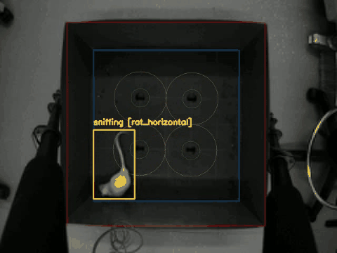
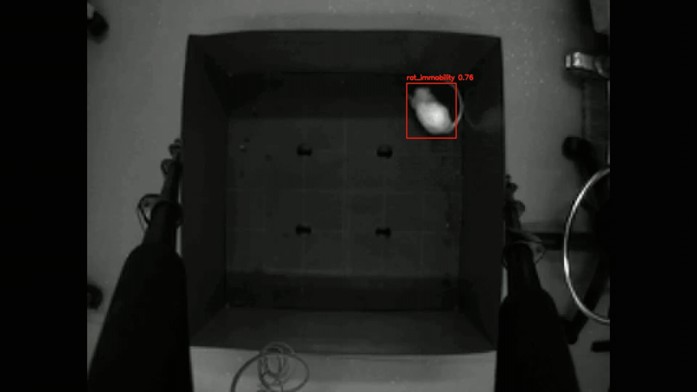

# Computer Vision Mice Tracking System
### Bachelor's Thesis (TFG) — Universidad Rey Juan Carlos (URJC)


**Automated behavioral analysis of rodents in Open Field Test experiments using Deep Learning (Pose Estimation + Spatial Logic).**

---



---

## Table of Contents

- [Project Overview](#project-overview)
- [Hybrid Architecture](#hybrid-architecture)
- [Detected Behaviors](#detected-behaviors)
- [Results](#results)
- [Project Structure](#project-structure)
- [Installation](#installation)
- [Usage](#usage)
- [Project Evolution (ADR)](#project-evolution-adr)

---

## Project Overview

This project automates the observation of the **Open Field Test (OFT)**, a standard protocol in pharmacology used to assess anxiety and locomotion in rodents — specifically white mice in a hole-board arena. Manual observation is time-consuming and subject to human bias; this system replaces it with a real-time Computer Vision pipeline.

**Key capabilities:**
- Detects and classifies **7 behaviors** from overhead video without manual annotation
- Outputs an annotated video, a per-frame CSV, a trajectory image and an Excel report — all in a single run
- Calibrates spatially to any camera position in under 2 minutes
- Runs on a consumer GPU with no cloud dependency

---

## Hybrid Architecture

The system uses a three-layer hybrid pipeline — each layer handles what it is best suited for:

| Layer | Component | Role |
|---|---|---|
| **Eyes** | YOLOv8-Pose | Detects the rat and predicts 3 skeletal keypoints (Snout · Spine · Tail) per frame |
| **Spatial logic** | `SpatialAnalyzer` | Uses calibrated zone geometry (walls, holes) to confirm or reclassify detections |
| **Temporal filter** | `_LabelStabilizer` | Hysteresis filter — a label must persist for ≥ 8 consecutive frames before switching |

**Why not a pure neural network end-to-end?**
The recording environment is hyper-controlled (same arena, same lighting, same camera). A CNN trained on this data memorises background and lighting rather than learning invariant posture geometry. The spatial rules (e.g. "head dipping = snout inside hole radius") are exact, interpretable, and require zero training data — making them more reliable than a learned classifier for these cases.

---

## Detected Behaviors

YOLO is trained on **5 visually distinct posture classes**. The spatial + temporal layers then derive **7 final behaviors**:

| # | YOLO Training Label | Final Behavior | Detection Layer |
|---|---|---|---|
| 1 | `rat_climbing` | **Climbing** | YOLO + bbox extends into wall zone |
| 2 | `rat_grooming` | **Grooming** | YOLO (direct) |
| 3 | `rat_head_dipping` | **Head Dipping** | YOLO + snout inside hole radius |
| 4 | `rat_rearing` | **Rearing** | YOLO + bbox aspect ratio ≥ 0.80 |
| 5 | `rat_horizontal` | **Walking** | Centroid speed > 0.35 (normalized) |
| 5 | `rat_horizontal` | **Immobile** | Centroid speed < 0.15 |
| 5 | `rat_horizontal` | **Sniffing** | Snout within 30 px of inner wall boundary |

`rat_horizontal` maps to three different behaviors because a single overhead frame cannot distinguish them — the rat's body silhouette is identical in all three cases. Speed threshold and snout position provide the missing information without any additional training.

### Arena Spatial Zones

```
┌──────────────────────────────────┐  ← Outer wall
│  [       WALL ZONE              ]│
│  ┌────────────────────────────┐  │
│  │                            │  │
│  │       ARENA INTERIOR       │  │  ← Inner boundary
│  │    ○    ○    ○    ○        │  │  ← 4 holes
│  │                            │  │
│  └────────────────────────────┘  │
│  [       WALL ZONE              ]│
└──────────────────────────────────┘
```

Zones are calibrated interactively per video (first frame is extracted automatically).

---

## Results

**Active model:** `exp8` — YOLOv8s-Pose, 100 epochs, 1 101 training images (×4.4 geometric augmentation)

| Metric | Value | Target | Status |
|---|---|---|---|
| mAP50 | **0.82** | ≥ 0.65 | OK |
| Recall | **0.887** | ≥ 0.70 | OK |
| val/train loss gap | **0.142** | ≤ 0.20 | OK |
| Detection rate on test video | **92.1 %** | — | — |

**Behavior distribution on `testRata5.mp4` (7.4 min, 15 fps):**

| Behavior | % of detected frames |
|---|---|
| Sniffing | 36.0 % |
| Climbing | 27.4 % |
| Head Dipping | 14.8 % |
| Walking | 7.4 % |
| Grooming | 8.1 % |
| Rearing | 5.7 % |
| Immobile | 0.6 % |

> **Why Recall over Precision:** A missed frame = a lost behavioral data point. Occasional false positives are filtered by the spatial logic downstream; false negatives are unrecoverable.

---

## Project Structure

```text
Computer-Vision-Mice-Tracking/
├── datasets/
│   ├── train/images/        # 1 101 training images (248 original + ×4.4 aug)
│   ├── valid/images/        # 48 validation images
│   ├── test/images/         # 23 test images
│   ├── data.yaml            # YOLO config (kpt_shape=[3,3], nc=5)
│   └── coords.json          # Calibration: outer wall, inner wall, 4 holes
├── media_original/
│   ├── poses.png                  # Reference: 5 training posture classes
│   ├── tracking_template.png
│   ├── DemoGit_rat.gif            # Phase 2 demo — bounding box detection
│   └── DemoGit_detection.gif      # Phase 6 demo — full pipeline v3 overlay
├── models/
│   ├── yolov8s-pose.pt      # Base pretrained model (Ultralytics)
│   └── yolo_ratas.pt        # Trained model — auto-copied after training
├── outputs/                 # Per-run results: annotated video + CSV + Excel + trajectory
├── runs/train/              # YOLO training runs (weights, metrics, plots)
└── scripts/
    ├── main_model.py        # Interactive entry point (menu)
    ├── config/
    │   ├── config.py        # Central config: Paths, TrainParams, DetectParams
    │   └── interfaces.py    # BaseModule abstract class
    ├── detection/
    │   ├── detector.py      # RatDetector — hybrid YOLO + spatial + temporal pipeline
    │   ├── trainer.py       # YOLOTrainer — geometric augmentation only
    │   └── calibrator.py    # ZoneCalibrator — interactive video calibration
    ├── spatial/
    │   └── spatial.py       # SpatialAnalyzer — dipping, sniffing, wall checks
    └── utils/
        ├── calibrator_image.py  # Static image calibrator
        └── stats_generator.py   # Excel report + trajectory image
```

---

## Installation

### Prerequisites

- Python 3.9+
- CUDA-compatible GPU (required for real-time inference; training strongly recommended on GPU)

### Steps

**1. Clone the repository:**
```bash
git clone https://github.com/S4H0ST/Computer-Vision-Mice-Tracking.git
cd Computer-Vision-Mice-Tracking
```

**2. Install dependencies:**
```bash
pip install torch torchvision torchaudio --index-url https://download.pytorch.org/whl/cu118
pip install ultralytics opencv-python pandas openpyxl pyyaml
```

---

## Usage

```bash
cd scripts
python main_model.py
```

### Menu Options

| Option | Action |
|---|---|
| **1 — Calibrate Zones** | Opens a file picker to select an image or video. Click to define the outer wall, inner wall, and the 4 hole centers. Saves `datasets/coords.json`. |
| **2 — Train YOLO Model** | Trains YOLOv8s-Pose for up to 100 epochs on `datasets/`. Copies `best.pt` to `models/yolo_ratas.pt` on completion. |
| **3 — Run Detection** | Picks a video, extracts the first frame for calibration (if needed), runs the full pipeline and saves results to `outputs/`. |
| **4 — Exit** | — |

### Output per Detection Run

Each run creates a folder `outputs/detections/{video}_{date}/` containing:

| File | Content |
|---|---|
| `{video}_{date}.mp4` | Annotated video — bbox + label + calibrated zone overlay |
| `{video}_{date}_label.mp4` | Clean video — bbox + label only (no zone overlay) |
| `{video}_{date}.csv` | Per-frame data: label, bbox, keypoints, speed |
| `stats/trajectory_{...}.png` | Animal path drawn over arena template |
| `stats/stats_{...}.xlsx` | Time budget per behavior + OFT pharmacological indices |

---

## Project Evolution (ADR)

The project went through 6 iterative phases. Each phase is linked to the commit where it was implemented.

<details>
<summary><strong>Phase 1 — Base Detection and Overfitting Control</strong></summary>

**Commit:** [17050d38](https://github.com/S4H0ST/Computer-Vision-Mice-Tracking/commit/17050d38f900f684169ed35e07098b993205c43e)

Standard YOLOv8 trained on a large frame-extracted dataset. Immediate overfitting — high visual similarity between frames caused the model to memorise background rather than learn posture. Fixed by drastically reducing dataset size and applying geometric augmentation only (no color changes — the environment is always the same white arena).
</details>

<details>
<summary><strong>Phase 2 — Behavior Labeling and CNN Limitations</strong></summary>

**Commit:** [a3c817d7](https://github.com/S4H0ST/Computer-Vision-Mice-Tracking/commit/a3c817d7a1edca2046258149519fc6171b413144)

Added 5 behavior classes. Found that Walking and Immobile are visually identical to a CNN — both produce the same horizontal bounding box. A single frame carries no temporal information.


</details>

<details>
<summary><strong>Phase 3 — Centroid Speed and Spatial Heuristics</strong></summary>

**Commit:** [60defaae](https://github.com/S4H0ST/Computer-Vision-Mice-Tracking/commit/60defaae6c993f1306cf4d460bde992cbd8418ae)

Introduced centroid displacement speed to separate Walking from Immobile:

$$v = \frac{\sqrt{(cx_t - cx_{t-1})^2 + (cy_t - cy_{t-1})^2}}{\Delta t}$$

Also mapped arena walls and holes as geometric zones. Functional but fragile — subtle posture changes bypassed the rules.
</details>

<details>
<summary><strong>Phase 4 — RNN Attempt and Architectural Limits</strong></summary>

**Commit:** [b9b8b741](https://github.com/S4H0ST/Computer-Vision-Mice-Tracking/commit/b9b8b741c3bdede00d62269d13e417b5c398bcdd)

Designed and implemented a 2-layer LSTM to analyse the temporal sequence of bounding box positions. Three structural problems prevented it from working:

1. **Circular supervision** — training data came from the detector's own CSV outputs, so the RNN learned YOLO's errors, not real behavior.
2. **Insufficient features** — bbox-only features (`cx, cy, w, h, speed`) carry less information than the spatial rules already in place.
3. **Class mismatch** — the RNN's output vocabulary (`rat_climbing`, `rat_horizontal`, …) did not include `walking`, `immobile`, `sniffing`.

The RNN never contributed to any detection output. Its code is archived for reference.
</details>

<details>
<summary><strong>Phase 5 — YOLOv8-Pose + Keypoint Spatial Logic</strong></summary>

Switched from bounding-box detection to pose estimation. YOLOv8-Pose adds 3 skeletal keypoints (Snout · Spine · Tail) to every detection.

**Impact:** behaviors that previously required learned temporal context can now be derived from geometry:
- Snout inside hole radius → `head_dipping` (exact rule, no training needed)
- Snout within 30 px of inner wall → `sniffing`
- Bbox extending beyond inner limits → `climbing`

Sub-phases 5b–5e covered: sharpness-split evaluation, offline geometric augmentation (×4.4, geometry-only), empirical validation on real video, iterative refinement of speed thresholds and climbing confirmation logic.

**Final dataset:** 1 101 training images from 248 originals. Class imbalance reduced from 5.8:1 to 1.48:1.
</details>

<details>
<summary><strong>Phase 5f — RNN Removal and Label Stabilizer</strong></summary>

Formally removed the RNN from the active pipeline. The only genuine value it could have added was **temporal smoothing** — preventing single-frame label flickers.

This is now handled by `_LabelStabilizer`: a deterministic hysteresis filter that requires a new label to appear for ≥ 8 consecutive frames (~0.27 s at 30 fps) before replacing the active label. The 8-frame threshold matches the minimum "behavioral bout" duration defined in Open Field Test ethology literature.

No training data, no model file, no warmup delay. The filter is interpretable and deterministic.
</details>

<details>
<summary><strong>Phase 6 — Model Selection and Pipeline v3</strong></summary>

Two candidates: **exp8** (mAP50=0.82, Recall=0.887) and **exp9** (mAP50=0.87, Recall=0.795).

Despite exp9's higher aggregate mAP50, visual validation revealed it lost 10.5 % of climbing detections and 5.7 % of grooming detections compared to exp8 on the same test video. **Aggregate metrics can hide per-class degradation** — visual validation on real video is non-negotiable.

exp8 was selected as the active model. Three post-processing improvements were applied (Pipeline v3):
- `conf_threshold` lowered 0.25 → 0.18 to recover minority class detections
- Climbing confirmation changed from snout-based to bbox-based (a rat can climb with its head pointing inward)
- `_LabelStabilizer` added (8-frame hysteresis)

Result: detection rate 92.1 %, climbing +13.4 pp over exp9 on the same test video.


> *testRata5.mp4 — exp8 model + pipeline v3. Bounding box + behavior label + calibrated zone overlay (inner wall boundary + hole markers). 30 s segment from minute 5: head dipping, walking, sniffing, climbing and grooming.*
</details>
